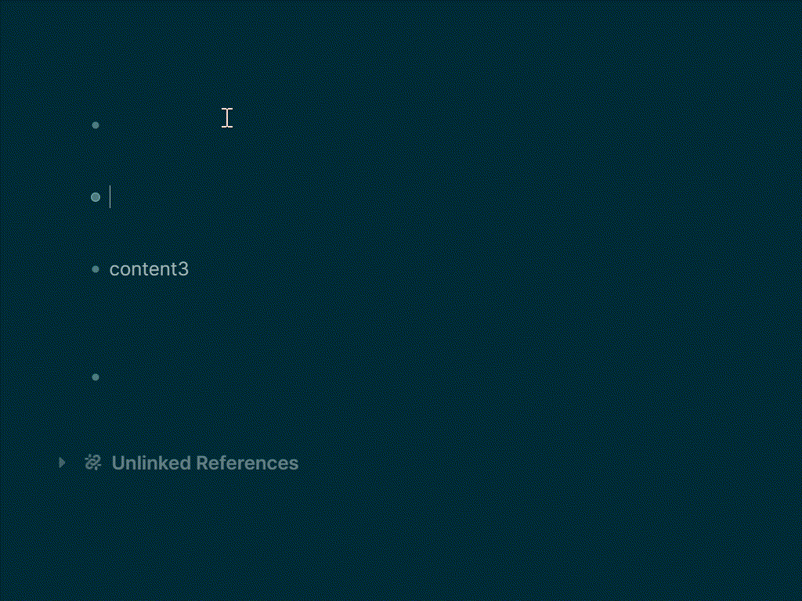

# Logseq Block Tabs

> *A logseq plugin to render a tabs in block, Sub-block as tab container.*

---
## Usage
- Slash command `/tabs` to insert a tabs for current editing block
- `{{renderer tabs, title1|title2|title3}}` to insert a tabs

---
## Licence
MIT
